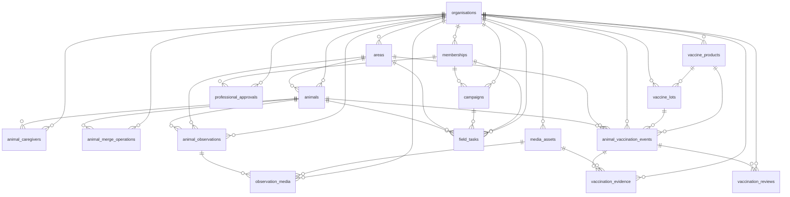

# Data dictionary

Generated from the database by `scripts/gen_data_dictionary.py` (do not edit the generated sections by hand).
Schema `app` holds all business data; it is not exposed through PostgREST. Every table has row-level security
enabled **and forced**; tenant tables use the policy `org_id = app.current_org_id()` (ADR 0003).

## Conventions

- Primary keys are UUIDs. User-facing animal references are separate random codes (`PG-XXXX-XXXX`).
- `timestamptz` for instants, `date` + an explicit precision column for calendar dates that may be partial.
- `unknown` is an explicit enumerated value; `NULL` means "not recorded" (never "no").
- Mutable rows carry `row_version` (incremented by trigger) for optimistic concurrency; `is_demo` marks fixtures.
- Exact coordinates (`geography(Point,4326)`) are returned only to members with `animal.location.exact`;
  `location_approx` is snapped to a ~500 m grid.

## Vocabulary notes

| Field | Meaning |
|---|---|
| `animals.profile_state` | Identity-record review state; says nothing about health or vaccination |
| `animal_vaccination_events.state` | `submitted` = awaiting veterinary review; `verified` = evidence accepted that a vaccine was recorded as given (not a statement that the animal cannot transmit disease) |
| `date_precision` | `exact_time` / `day` / `month` (stored as 1st of month) / `year` (stored as 1 Jan) / `unknown` (date NULL) |
| `media_assets.state` | `pending_upload` → `uploaded` → `validating` → `approved`/`rejected`; only approved files are shown |
| `field_tasks.task_type` | `animal_followup`, `evidence_correction`, `identity_review` form the view `animal_followup_tasks` (ADR 0007) |

_Schema revision: `0011`._

## ER diagram (core Prevention tables)

## Tables

### `app.animal_caregivers`

RLS enabled + forced.

| Column | Type | Null | Default |
|---|---|---|---|
| `id` | uuid | no | extensions.gen_random_uuid() |
| `org_id` | uuid | no |  |
| `animal_id` | uuid | no |  |
| `relationship` | text | no |  |
| `contact_name` | text | yes |  |
| `contact_phone` | text | yes |  |
| `contact_notes` | text | yes |  |
| `linked_user_id` | uuid | yes |  |
| `consent_record_id` | uuid | yes |  |
| `valid_from` | date | no | CURRENT_DATE |
| `valid_to` | date | yes |  |
| `is_demo` | boolean | no | false |
| `created_at` | timestamp with time zone | no | now() |
| `created_by` | uuid | yes |  |
| `updated_at` | timestamp with time zone | no | now() |
| `row_version` | integer | no | 1 |

Constraints

- `animal_caregivers_contact_name_check`: `CHECK ((char_length(contact_name) <= 120))`
- `animal_caregivers_contact_notes_check`: `CHECK ((char_length(contact_notes) <= 500))`
- `animal_caregivers_contact_phone_check`: `CHECK ((contact_phone ~ '^\+?[0-9 ()-]{6,20}$'::text))`
- `animal_caregivers_relationship_check`: `CHECK ((relationship = ANY (ARRAY['owner'::text, 'feeder'::text, 'caretaker'::text, 'other'::text])))`

Policies: `animal_caregivers_tenant` (all, permissive); `caregivers_capability` (select, restrictive); `caregivers_write_capability` (insert, restrictive)

### `app.animal_embeddings`

RLS enabled + forced.

| Column | Type | Null | Default |
|---|---|---|---|
| `id` | uuid | no | extensions.gen_random_uuid() |
| `org_id` | uuid | no |  |
| `animal_id` | uuid | no |  |
| `observation_media_id` | uuid | no |  |
| `media_id` | uuid | no |  |
| `crop_key` | text | no |  |
| `model_version_id` | uuid | no |  |
| `embedding` | vector | no |  |
| `normalised` | boolean | no | true |
| `state` | text | no | 'active'::text |
| `excluded_reason` | text | yes |  |
| `is_demo` | boolean | no | false |
| `created_at` | timestamp with time zone | no | now() |

Constraints

- `animal_embeddings_media_id_crop_key_model_version_id_key`: `UNIQUE (media_id, crop_key, model_version_id)`
- `animal_embeddings_state_check`: `CHECK ((state = ANY (ARRAY['active'::text, 'excluded'::text])))`

Policies: `animal_embeddings_tenant` (all, permissive)

### `app.animal_merge_operations`

RLS enabled + forced.

| Column | Type | Null | Default |
|---|---|---|---|
| `id` | uuid | no | extensions.gen_random_uuid() |
| `org_id` | uuid | no |  |
| `source_animal_id` | uuid | no |  |
| `target_animal_id` | uuid | no |  |
| `state` | text | no | 'proposed'::text |
| `reason` | text | no |  |
| `proposed_by` | uuid | no |  |
| `decided_by` | uuid | yes |  |
| `executed_at` | timestamp with time zone | yes |  |
| `manifest` | jsonb | no | '{}'::jsonb |
| `reversed_by` | uuid | yes |  |
| `reversed_at` | timestamp with time zone | yes |  |
| `reversal_reason` | text | yes |  |
| `is_demo` | boolean | no | false |
| `created_at` | timestamp with time zone | no | now() |
| `created_by` | uuid | yes |  |
| `updated_at` | timestamp with time zone | no | now() |
| `row_version` | integer | no | 1 |

Constraints

- `animal_merge_operations_check`: `CHECK ((source_animal_id <> target_animal_id))`
- `animal_merge_operations_check1`: `CHECK (((state <> 'reversed'::text) OR ((reversed_by IS NOT NULL) AND (reversal_reason IS NOT NULL))))`
- `animal_merge_operations_reason_check`: `CHECK ((char_length(reason) >= 3))`
- `animal_merge_operations_state_check`: `CHECK ((state = ANY (ARRAY['proposed'::text, 'executed'::text, 'reversed'::text, 'rejected'::text])))`

Policies: `animal_merge_operations_tenant` (all, permissive)

### `app.animal_observations`

RLS enabled + forced.

| Column | Type | Null | Default |
|---|---|---|---|
| `id` | uuid | no | extensions.gen_random_uuid() |
| `org_id` | uuid | no |  |
| `animal_id` | uuid | yes |  |
| `reported_animal_reference` | text | yes |  |
| `observer_user_id` | uuid | no |  |
| `observed_at` | timestamp with time zone | yes |  |
| `observed_on` | date | yes |  |
| `time_precision` | text | no |  |
| `location` | geography | yes |  |
| `location_approx` | geography | yes |  |
| `location_accuracy_m` | numeric | yes |  |
| `location_method` | text | no | 'unknown'::text |
| `area_id` | uuid | yes |  |
| `notes` | text | yes |  |
| `source_type` | text | no | 'field_entry'::text |
| `field_task_id` | uuid | yes |  |
| `client_operation_id` | uuid | yes |  |
| `is_demo` | boolean | no | false |
| `created_at` | timestamp with time zone | no | now() |
| `created_by` | uuid | yes |  |
| `updated_at` | timestamp with time zone | no | now() |
| `row_version` | integer | no | 1 |

Constraints

- `animal_observations_check`: `CHECK (((time_precision = 'unknown'::text) OR (observed_at IS NOT NULL) OR (observed_on IS NOT NULL)))`
- `animal_observations_check1`: `CHECK (((location IS NULL) = (location_approx IS NULL)))`
- `animal_observations_id_org_id_key`: `UNIQUE (id, org_id)`
- `animal_observations_location_accuracy_m_check`: `CHECK (((location_accuracy_m IS NULL) OR (location_accuracy_m >= (0)::numeric)))`
- `animal_observations_location_method_check`: `CHECK ((location_method = ANY (ARRAY['gps'::text, 'map_pick'::text, 'area_only'::text, 'described'::text, 'unknown'::text])))`
- `animal_observations_notes_check`: `CHECK ((char_length(notes) <= 1000))`
- `animal_observations_org_id_client_operation_id_key`: `UNIQUE (org_id, client_operation_id)`
- `animal_observations_source_type_check`: `CHECK ((source_type = ANY (ARRAY['field_entry'::text, 'import'::text, 'sync'::text])))`
- `animal_observations_time_precision_check`: `CHECK ((time_precision = ANY (ARRAY['exact'::text, 'day'::text, 'month'::text, 'unknown'::text])))`

Policies: `animal_observations_tenant` (all, permissive)

### `app.animal_vaccination_events`

RLS enabled + forced.

| Column | Type | Null | Default |
|---|---|---|---|
| `id` | uuid | no | extensions.gen_random_uuid() |
| `org_id` | uuid | no |  |
| `animal_id` | uuid | no |  |
| `original_animal_id` | uuid | no |  |
| `administered_on` | date | yes |  |
| `administered_at` | timestamp with time zone | yes |  |
| `date_precision` | text | no |  |
| `product_id` | uuid | yes |  |
| `product_text` | text | yes |  |
| `lot_id` | uuid | yes |  |
| `lot_text` | text | yes |  |
| `administered_by_name` | text | yes |  |
| `administered_by_registration` | text | yes |  |
| `administered_by_user_id` | uuid | yes |  |
| `area_id` | uuid | yes |  |
| `location` | geography | yes |  |
| `source_type` | text | no |  |
| `source_reference` | text | yes |  |
| `submitter_note` | text | yes |  |
| `state` | text | no | 'submitted'::text |
| `supersedes_event_id` | uuid | yes |  |
| `superseded_by_event_id` | uuid | yes |  |
| `has_conflict` | boolean | no | false |
| `next_review_on` | date | yes |  |
| `next_review_source` | text | yes |  |
| `submitted_by` | uuid | yes |  |
| `submitted_at` | timestamp with time zone | yes |  |
| `verified_by` | uuid | yes |  |
| `verified_at` | timestamp with time zone | yes |  |
| `client_operation_id` | uuid | yes |  |
| `is_demo` | boolean | no | false |
| `created_at` | timestamp with time zone | no | now() |
| `created_by` | uuid | yes |  |
| `updated_at` | timestamp with time zone | no | now() |
| `row_version` | integer | no | 1 |

Constraints

- `animal_vaccination_events_administered_by_name_check`: `CHECK ((char_length(administered_by_name) <= 200))`
- `animal_vaccination_events_administered_by_registration_check`: `CHECK ((char_length(administered_by_registration) <= 100))`
- `animal_vaccination_events_check`: `CHECK (((date_precision = 'unknown'::text) = (administered_on IS NULL)))`
- `animal_vaccination_events_check1`: `CHECK (((date_precision <> 'exact_time'::text) OR (administered_at IS NOT NULL)))`
- `animal_vaccination_events_check2`: `CHECK (((date_precision <> 'month'::text) OR (EXTRACT(day FROM administered_on) = (1)::numeric)))`
- `animal_vaccination_events_check3`: `CHECK (((date_precision <> 'year'::text) OR ((EXTRACT(day FROM administered_on) = (1)::numeric) AND (EXTRACT(month FROM administered_on) = (1)::numeric))))`
- `animal_vaccination_events_check4`: `CHECK (((state = 'draft'::text) OR ((submitted_by IS NOT NULL) AND (submitted_at IS NOT NULL))))`
- `animal_vaccination_events_check5`: `CHECK (((state = 'verified'::text) = ((verified_by IS NOT NULL) AND (verified_at IS NOT NULL))))`
- `animal_vaccination_events_check6`: `CHECK (((next_review_on IS NULL) = (next_review_source IS NULL)))`
- `animal_vaccination_events_check7`: `CHECK (((product_id IS NULL) OR (product_text IS NULL)))`
- `animal_vaccination_events_check8`: `CHECK (((lot_id IS NULL) OR (lot_text IS NULL)))`
- `animal_vaccination_events_date_precision_check`: `CHECK ((date_precision = ANY (ARRAY['exact_time'::text, 'day'::text, 'month'::text, 'year'::text, 'unknown'::text])))`
- `animal_vaccination_events_id_org_id_key`: `UNIQUE (id, org_id)`
- `animal_vaccination_events_lot_text_check`: `CHECK ((char_length(lot_text) <= 40))`
- `animal_vaccination_events_org_id_client_operation_id_key`: `UNIQUE (org_id, client_operation_id)`
- `animal_vaccination_events_product_text_check`: `CHECK ((char_length(product_text) <= 200))`
- `animal_vaccination_events_source_type_check`: `CHECK ((source_type = ANY (ARRAY['field_entry'::text, 'certificate_upload'::text, 'import'::text, 'partner_record'::text, 'sync'::text])))`
- `animal_vaccination_events_state_check`: `CHECK ((state = ANY (ARRAY['draft'::text, 'submitted'::text, 'verified'::text, 'rejected'::text, 'needs_correction'::text, 'superseded'::text])))`
- `animal_vaccination_events_submitter_note_check`: `CHECK ((char_length(submitter_note) <= 1000))`

Policies: `animal_vaccination_events_tenant` (all, permissive)

### `app.animals`

RLS enabled + forced.

| Column | Type | Null | Default |
|---|---|---|---|
| `id` | uuid | no | extensions.gen_random_uuid() |
| `org_id` | uuid | no |  |
| `reference_code` | text | no | app.new_reference_code() |
| `species` | text | no | 'dog'::text |
| `nickname` | text | yes |  |
| `sex` | text | no | 'unknown'::text |
| `sterilisation_status` | text | no | 'unknown'::text |
| `age_band` | text | no | 'unknown'::text |
| `coat_description` | text | yes |  |
| `identifying_marks` | text | yes |  |
| `breed_note` | text | yes |  |
| `ownership_category` | text | no | 'unknown'::text |
| `profile_state` | text | no | 'provisional'::text |
| `merged_into_id` | uuid | yes |  |
| `home_area_id` | uuid | yes |  |
| `last_observed_at` | timestamp with time zone | yes |  |
| `archived_reason` | text | yes |  |
| `source_type` | text | no | 'field_entry'::text |
| `source_reference` | text | yes |  |
| `client_operation_id` | uuid | yes |  |
| `is_demo` | boolean | no | false |
| `created_at` | timestamp with time zone | no | now() |
| `created_by` | uuid | yes |  |
| `updated_at` | timestamp with time zone | no | now() |
| `row_version` | integer | no | 1 |

Constraints

- `animals_age_band_check`: `CHECK ((age_band = ANY (ARRAY['puppy'::text, 'young'::text, 'adult'::text, 'senior'::text, 'unknown'::text])))`
- `animals_breed_note_check`: `CHECK ((char_length(breed_note) <= 120))`
- `animals_check`: `CHECK (((profile_state = 'merged_alias'::text) = (merged_into_id IS NOT NULL)))`
- `animals_check1`: `CHECK (((merged_into_id IS NULL) OR (merged_into_id <> id)))`
- `animals_coat_description_check`: `CHECK ((char_length(coat_description) <= 300))`
- `animals_id_org_id_key`: `UNIQUE (id, org_id)`
- `animals_identifying_marks_check`: `CHECK ((char_length(identifying_marks) <= 500))`
- `animals_nickname_check`: `CHECK ((char_length(nickname) <= 80))`
- `animals_org_id_client_operation_id_key`: `UNIQUE (org_id, client_operation_id)`
- `animals_org_id_reference_code_key`: `UNIQUE (org_id, reference_code)`
- `animals_ownership_category_check`: `CHECK ((ownership_category = ANY (ARRAY['owned'::text, 'community'::text, 'unowned'::text, 'shelter'::text, 'unknown'::text])))`
- `animals_profile_state_check`: `CHECK ((profile_state = ANY (ARRAY['provisional'::text, 'reviewed'::text, 'active'::text, 'disputed'::text, 'merged_alias'::text, 'archived'::text])))`
- `animals_reference_code_check`: `CHECK ((reference_code ~ '^PG-[0-9A-HJKMNP-TV-Z]{4}-[0-9A-HJKMNP-TV-Z]{4}$'::text))`
- `animals_sex_check`: `CHECK ((sex = ANY (ARRAY['female'::text, 'male'::text, 'unknown'::text])))`
- `animals_source_type_check`: `CHECK ((source_type = ANY (ARRAY['field_entry'::text, 'import'::text, 'partner_record'::text, 'sync'::text])))`
- `animals_species_check`: `CHECK ((species = ANY (ARRAY['dog'::text, 'cat'::text, 'other'::text, 'unknown'::text])))`
- `animals_sterilisation_status_check`: `CHECK ((sterilisation_status = ANY (ARRAY['sterilised'::text, 'not_sterilised'::text, 'unknown'::text])))`

Policies: `animals_tenant` (all, permissive)

### `app.annotation_events`

RLS enabled + forced.

| Column | Type | Null | Default |
|---|---|---|---|
| `id` | uuid | no | extensions.gen_random_uuid() |
| `dataset_sample_id` | uuid | no |  |
| `annotator` | text | no |  |
| `task` | text | no |  |
| `outcome` | text | no |  |
| `proposed_label` | text | yes |  |
| `proposed_box` | jsonb | yes |  |
| `adjudicator` | text | yes |  |
| `adjudicated_outcome` | text | yes |  |
| `note` | text | yes |  |
| `created_at` | timestamp with time zone | no | now() |

Constraints

- `annotation_events_note_check`: `CHECK ((char_length(note) <= 1000))`
- `annotation_events_outcome_check`: `CHECK ((outcome = ANY (ARRAY['agree'::text, 'disagree'::text, 'cannot_tell'::text, 'not_dog'::text, 'multiple_dogs'::text, 'usable'::text, 'not_usable'::text])))`
- `annotation_events_task_check`: `CHECK ((task = ANY (ARRAY['identity_same'::text, 'identity_group'::text, 'subject_box'::text, 'usable_for_id'::text])))`

### `app.areas`

RLS enabled + forced.

| Column | Type | Null | Default |
|---|---|---|---|
| `id` | uuid | no | extensions.gen_random_uuid() |
| `org_id` | uuid | no |  |
| `code` | text | no |  |
| `name` | text | no |  |
| `kind` | text | no | 'ward'::text |
| `parent_area_id` | uuid | yes |  |
| `boundary` | geometry | yes |  |
| `boundary_source` | text | yes |  |
| `boundary_version` | text | yes |  |
| `effective_from` | date | no | CURRENT_DATE |
| `effective_to` | date | yes |  |
| `is_demo` | boolean | no | false |
| `created_at` | timestamp with time zone | no | now() |
| `created_by` | uuid | yes |  |
| `updated_at` | timestamp with time zone | no | now() |
| `row_version` | integer | no | 1 |

Constraints

- `areas_check`: `CHECK (((effective_to IS NULL) OR (effective_to > effective_from)))`
- `areas_code_check`: `CHECK (((char_length(code) >= 1) AND (char_length(code) <= 64)))`
- `areas_id_org_id_key`: `UNIQUE (id, org_id)`
- `areas_kind_check`: `CHECK ((kind = ANY (ARRAY['district'::text, 'zone'::text, 'ward'::text, 'locality'::text, 'other'::text])))`
- `areas_name_check`: `CHECK (((char_length(name) >= 1) AND (char_length(name) <= 200)))`
- `areas_org_id_code_effective_from_key`: `UNIQUE (org_id, code, effective_from)`

Policies: `areas_tenant` (all, permissive)

### `app.audit_events`

RLS enabled + forced.

| Column | Type | Null | Default |
|---|---|---|---|
| `id` | uuid | no | extensions.gen_random_uuid() |
| `occurred_at` | timestamp with time zone | no | now() |
| `org_id` | uuid | yes |  |
| `actor_user_id` | uuid | yes |  |
| `actor_kind` | text | no |  |
| `action` | text | no |  |
| `target_type` | text | yes |  |
| `target_id` | uuid | yes |  |
| `request_id` | text | yes |  |
| `reason` | text | yes |  |
| `change_summary` | jsonb | no | '{}'::jsonb |

Constraints

- `audit_events_action_check`: `CHECK ((action ~ '^[a-z_]+(\.[a-z_]+)+$'::text))`
- `audit_events_actor_kind_check`: `CHECK ((actor_kind = ANY (ARRAY['user'::text, 'worker'::text, 'system'::text, 'cli'::text])))`
- `audit_events_reason_check`: `CHECK ((char_length(reason) <= 2000))`

Policies: `audit_events_insert` (insert, permissive); `audit_events_select` (select, permissive)

### `app.background_jobs`

RLS enabled + forced.

| Column | Type | Null | Default |
|---|---|---|---|
| `id` | uuid | no | extensions.gen_random_uuid() |
| `org_id` | uuid | no |  |
| `job_type` | text | no |  |
| `target_type` | text | no |  |
| `target_id` | uuid | no |  |
| `state` | text | no | 'queued'::text |
| `attempts` | integer | no | 0 |
| `max_attempts` | integer | no | 3 |
| `last_error_code` | text | yes |  |
| `result` | jsonb | no | '{}'::jsonb |
| `locked_by` | text | yes |  |
| `locked_until` | timestamp with time zone | yes |  |
| `queued_at` | timestamp with time zone | no | now() |
| `started_at` | timestamp with time zone | yes |  |
| `finished_at` | timestamp with time zone | yes |  |
| `created_by` | uuid | yes |  |
| `row_version` | integer | no | 1 |
| `updated_at` | timestamp with time zone | no | now() |

Constraints

- `background_jobs_attempts_check`: `CHECK ((attempts >= 0))`
- `background_jobs_job_type_check`: `CHECK ((job_type ~ '^[a-z_]+(\.[a-z_]+)+$'::text))`
- `background_jobs_max_attempts_check`: `CHECK (((max_attempts >= 1) AND (max_attempts <= 20)))`
- `background_jobs_state_check`: `CHECK ((state = ANY (ARRAY['queued'::text, 'processing'::text, 'completed'::text, 'failed'::text, 'cancelled'::text, 'needs_input'::text])))`

Policies: `background_jobs_tenant` (all, permissive); `jobs_dispatcher` (all, permissive, roles pawguard_worker)

### `app.campaign_areas`

RLS enabled + forced.

| Column | Type | Null | Default |
|---|---|---|---|
| `id` | uuid | no | extensions.gen_random_uuid() |
| `org_id` | uuid | no |  |
| `campaign_id` | uuid | no |  |
| `area_id` | uuid | no |  |
| `is_demo` | boolean | no | false |
| `created_at` | timestamp with time zone | no | now() |
| `created_by` | uuid | yes |  |
| `updated_at` | timestamp with time zone | no | now() |
| `row_version` | integer | no | 1 |
| `est_animals` | integer | yes |  |
| `est_source` | text | yes |  |
| `service_minutes_per_animal` | numeric | no | 4 |
| `access_start` | time without time zone | yes |  |
| `access_end` | time without time zone | yes |  |
| `accessible` | boolean | no | true |
| `access_note` | text | yes |  |
| `priority` | smallint | no | 2 |

Constraints

- `campaign_areas_access_note_check`: `CHECK ((char_length(access_note) <= 300))`
- `campaign_areas_campaign_id_area_id_key`: `UNIQUE (campaign_id, area_id)`
- `campaign_areas_est_animals_check`: `CHECK (((est_animals IS NULL) OR ((est_animals >= 0) AND (est_animals <= 100000))))`
- `campaign_areas_est_source_check`: `CHECK ((est_source = ANY (ARRAY['survey'::text, 'registry'::text, 'manual'::text])))`
- `campaign_areas_priority_check`: `CHECK (((priority >= 1) AND (priority <= 3)))`
- `campaign_areas_service_minutes_per_animal_check`: `CHECK (((service_minutes_per_animal > (0)::numeric) AND (service_minutes_per_animal <= (120)::numeric)))`
- `campaign_areas_window`: `CHECK (((access_start IS NULL) OR (access_end IS NULL) OR (access_end > access_start)))`

Policies: `campaign_areas_tenant` (all, permissive)

### `app.campaign_plans`

RLS enabled + forced.

| Column | Type | Null | Default |
|---|---|---|---|
| `id` | uuid | no | extensions.gen_random_uuid() |
| `org_id` | uuid | no |  |
| `campaign_id` | uuid | no |  |
| `version` | integer | no |  |
| `plan_date` | date | no |  |
| `state` | text | no | 'solving'::text |
| `inputs` | jsonb | no |  |
| `result` | jsonb | no | '{}'::jsonb |
| `travel_basis` | text | no | 'straight_line_estimate'::text |
| `solver_version` | text | yes |  |
| `failure_code` | text | yes |  |
| `created_by` | uuid | no |  |
| `approved_by` | uuid | yes |  |
| `approved_at` | timestamp with time zone | yes |  |
| `approval_note` | text | yes |  |
| `published_by` | uuid | yes |  |
| `published_at` | timestamp with time zone | yes |  |
| `task_ids` | ARRAY | no | '{}'::uuid[] |
| `is_demo` | boolean | no | false |
| `created_at` | timestamp with time zone | no | now() |
| `updated_at` | timestamp with time zone | no | now() |
| `row_version` | integer | no | 1 |

Constraints

- `campaign_plans_approval_note_check`: `CHECK ((char_length(approval_note) <= 500))`
- `campaign_plans_campaign_id_version_key`: `UNIQUE (campaign_id, version)`
- `campaign_plans_check`: `CHECK (((state = ANY (ARRAY['approved'::text, 'published'::text])) <= (approved_by IS NOT NULL)))`
- `campaign_plans_check1`: `CHECK ((((state = 'published'::text) = (published_at IS NOT NULL)) OR (state = 'superseded'::text)))`
- `campaign_plans_id_org_id_key`: `UNIQUE (id, org_id)`
- `campaign_plans_state_check`: `CHECK ((state = ANY (ARRAY['solving'::text, 'ready'::text, 'failed'::text, 'approved'::text, 'published'::text, 'superseded'::text])))`
- `campaign_plans_travel_basis_check`: `CHECK ((travel_basis = ANY (ARRAY['straight_line_estimate'::text, 'travel_time_matrix'::text])))`
- `campaign_plans_version_check`: `CHECK ((version >= 1))`

Policies: `campaign_plans_tenant` (all, permissive)

### `app.campaigns`

RLS enabled + forced.

| Column | Type | Null | Default |
|---|---|---|---|
| `id` | uuid | no | extensions.gen_random_uuid() |
| `org_id` | uuid | no |  |
| `name` | text | no |  |
| `purpose` | text | yes |  |
| `activity` | text | no | 'vaccination'::text |
| `starts_on` | date | yes |  |
| `ends_on` | date | yes |  |
| `coordinator_membership_id` | uuid | yes |  |
| `state` | text | no | 'draft'::text |
| `resources` | jsonb | no | '{}'::jsonb |
| `is_demo` | boolean | no | false |
| `created_at` | timestamp with time zone | no | now() |
| `created_by` | uuid | yes |  |
| `updated_at` | timestamp with time zone | no | now() |
| `row_version` | integer | no | 1 |

Constraints

- `campaigns_activity_check`: `CHECK ((activity = ANY (ARRAY['vaccination'::text, 'survey'::text, 'mixed'::text, 'other'::text])))`
- `campaigns_check`: `CHECK (((ends_on IS NULL) OR (starts_on IS NULL) OR (ends_on >= starts_on)))`
- `campaigns_id_org_id_key`: `UNIQUE (id, org_id)`
- `campaigns_name_check`: `CHECK (((char_length(name) >= 1) AND (char_length(name) <= 200)))`
- `campaigns_state_check`: `CHECK ((state = ANY (ARRAY['draft'::text, 'approved'::text, 'active'::text, 'closed'::text])))`

Policies: `campaigns_tenant` (all, permissive)

### `app.consent_records`

RLS enabled + forced.

| Column | Type | Null | Default |
|---|---|---|---|
| `id` | uuid | no | extensions.gen_random_uuid() |
| `org_id` | uuid | no |  |
| `subject_type` | text | no |  |
| `subject_ref` | uuid | yes |  |
| `purpose` | text | no |  |
| `notice_version` | text | no |  |
| `granted_at` | timestamp with time zone | yes |  |
| `withdrawn_at` | timestamp with time zone | yes |  |
| `method` | text | no |  |
| `recorded_by` | uuid | yes |  |
| `is_demo` | boolean | no | false |
| `created_at` | timestamp with time zone | no | now() |
| `created_by` | uuid | yes |  |
| `updated_at` | timestamp with time zone | no | now() |
| `row_version` | integer | no | 1 |

Constraints

- `consent_records_check`: `CHECK (((withdrawn_at IS NULL) OR (granted_at IS NULL) OR (withdrawn_at >= granted_at)))`
- `consent_records_method_check`: `CHECK ((method = ANY (ARRAY['verbal_recorded'::text, 'written'::text, 'in_app'::text, 'partner_agreement'::text, 'other'::text])))`
- `consent_records_purpose_check`: `CHECK ((purpose = ANY (ARRAY['operational_contact'::text, 'operational_records'::text, 'model_training'::text, 'research'::text, 'publication'::text])))`
- `consent_records_subject_type_check`: `CHECK ((subject_type = ANY (ARRAY['caregiver_contact'::text, 'user'::text, 'media_subject'::text, 'other'::text])))`

Policies: `consent_records_tenant` (all, permissive)

### `app.data_quality_issues`

RLS enabled + forced.

| Column | Type | Null | Default |
|---|---|---|---|
| `id` | uuid | no | extensions.gen_random_uuid() |
| `org_id` | uuid | no |  |
| `resource_type` | text | no |  |
| `resource_id` | uuid | no |  |
| `rule` | text | no |  |
| `rule_version` | text | no | '1'::text |
| `severity` | text | no |  |
| `explanation` | text | no |  |
| `state` | text | no | 'open'::text |
| `resolved_by` | uuid | yes |  |
| `resolution_note` | text | yes |  |
| `resolved_at` | timestamp with time zone | yes |  |
| `is_demo` | boolean | no | false |
| `created_at` | timestamp with time zone | no | now() |
| `created_by` | uuid | yes |  |
| `updated_at` | timestamp with time zone | no | now() |
| `row_version` | integer | no | 1 |

Constraints

- `data_quality_issues_severity_check`: `CHECK ((severity = ANY (ARRAY['info'::text, 'warning'::text, 'blocking'::text])))`
- `data_quality_issues_state_check`: `CHECK ((state = ANY (ARRAY['open'::text, 'resolved'::text, 'dismissed'::text])))`

Policies: `data_quality_issues_tenant` (all, permissive)

### `app.data_sources`

RLS enabled + forced.

| Column | Type | Null | Default |
|---|---|---|---|
| `id` | uuid | no | extensions.gen_random_uuid() |
| `org_id` | uuid | no |  |
| `name` | text | no |  |
| `owner` | text | yes |  |
| `reference` | text | yes |  |
| `licence_terms` | text | yes |  |
| `permitted_uses` | ARRAY | no | '{}'::text[] |
| `access_status` | text | no | 'unknown'::text |
| `version_label` | text | yes |  |
| `checksum` | text | yes |  |
| `last_checked_on` | date | yes |  |
| `is_demo` | boolean | no | false |
| `created_at` | timestamp with time zone | no | now() |
| `created_by` | uuid | yes |  |
| `updated_at` | timestamp with time zone | no | now() |
| `row_version` | integer | no | 1 |

Constraints

- `data_sources_access_status_check`: `CHECK ((access_status = ANY (ARRAY['available'::text, 'restricted'::text, 'pending'::text, 'unavailable'::text, 'unknown'::text])))`
- `data_sources_name_check`: `CHECK (((char_length(name) >= 1) AND (char_length(name) <= 300)))`

Policies: `data_sources_tenant` (all, permissive)

### `app.dataset_samples`

RLS enabled + forced.

| Column | Type | Null | Default |
|---|---|---|---|
| `id` | uuid | no | extensions.gen_random_uuid() |
| `dataset_version_id` | uuid | no |  |
| `sample_key` | text | no |  |
| `media_id` | uuid | yes |  |
| `source_sha256` | text | no |  |
| `phash` | text | yes |  |
| `identity_label` | text | yes |  |
| `label_confidence` | text | no | 'asserted'::text |
| `session_group` | text | yes |  |
| `site_group` | text | yes |  |
| `captured_on` | date | yes |  |
| `modality` | text | no | 'unknown'::text |
| `quality_flags` | ARRAY | no | '{}'::text[] |
| `dup_group` | text | yes |  |
| `split` | text | yes |  |
| `split_role` | text | yes |  |
| `exclusion_reason` | text | yes |  |
| `adjudication_state` | text | no | 'none'::text |
| `transform_version` | text | yes |  |

Constraints

- `dataset_samples_adjudication_state_check`: `CHECK ((adjudication_state = ANY (ARRAY['none'::text, 'pending'::text, 'agreed'::text, 'adjudicated'::text])))`
- `dataset_samples_check`: `CHECK (((split = 'excluded'::text) = (exclusion_reason IS NOT NULL)))`
- `dataset_samples_dataset_version_id_sample_key_key`: `UNIQUE (dataset_version_id, sample_key)`
- `dataset_samples_label_confidence_check`: `CHECK ((label_confidence = ANY (ARRAY['asserted'::text, 'reviewed'::text, 'disputed'::text, 'rejected'::text])))`
- `dataset_samples_modality_check`: `CHECK ((modality = ANY (ARRAY['face'::text, 'full_body'::text, 'unknown'::text])))`
- `dataset_samples_source_sha256_check`: `CHECK ((source_sha256 ~ '^[0-9a-f]{64}$'::text))`
- `dataset_samples_split_check`: `CHECK ((split = ANY (ARRAY['train'::text, 'val'::text, 'test'::text, 'excluded'::text])))`
- `dataset_samples_split_role_check`: `CHECK ((split_role = ANY (ARRAY['gallery'::text, 'query'::text, 'unknown_query'::text, 'training'::text])))`

Policies: `dataset_samples_read` (select, permissive, roles pawguard_api,pawguard_worker)

### `app.dataset_versions`

RLS enabled + forced.

| Column | Type | Null | Default |
|---|---|---|---|
| `id` | uuid | no | extensions.gen_random_uuid() |
| `org_id` | uuid | yes |  |
| `name` | text | no |  |
| `version` | text | no |  |
| `purpose` | text | no |  |
| `source_reference` | text | no |  |
| `rights_summary` | text | no |  |
| `consent_scope` | text | no |  |
| `modality` | text | no | 'unknown'::text |
| `manifest_path` | text | no |  |
| `manifest_sha256` | text | no |  |
| `split_manifest_path` | text | yes |  |
| `split_sha256` | text | yes |  |
| `counts` | jsonb | no | '{}'::jsonb |
| `status` | text | no | 'draft'::text |
| `notes` | text | yes |  |
| `created_at` | timestamp with time zone | no | now() |
| `frozen_at` | timestamp with time zone | yes |  |

Constraints

- `dataset_versions_check`: `CHECK (((status <> 'frozen'::text) OR ((split_sha256 IS NOT NULL) AND (frozen_at IS NOT NULL))))`
- `dataset_versions_consent_scope_check`: `CHECK ((consent_scope = ANY (ARRAY['research_only'::text, 'operational'::text, 'operational_and_training'::text, 'synthetic'::text])))`
- `dataset_versions_manifest_sha256_check`: `CHECK ((manifest_sha256 ~ '^[0-9a-f]{64}$'::text))`
- `dataset_versions_modality_check`: `CHECK ((modality = ANY (ARRAY['face'::text, 'full_body'::text, 'mixed'::text, 'unknown'::text])))`
- `dataset_versions_name_version_key`: `UNIQUE (name, version)`
- `dataset_versions_purpose_check`: `CHECK ((purpose = ANY (ARRAY['research_benchmark'::text, 'partner_pilot'::text, 'evaluation_frozen'::text, 'synthetic_fixture'::text])))`
- `dataset_versions_split_sha256_check`: `CHECK (((split_sha256 IS NULL) OR (split_sha256 ~ '^[0-9a-f]{64}$'::text)))`
- `dataset_versions_status_check`: `CHECK ((status = ANY (ARRAY['draft'::text, 'frozen'::text, 'retired'::text])))`

Policies: `dataset_versions_read` (select, permissive, roles pawguard_api,pawguard_worker)

### `app.detection_results`

RLS enabled + forced.

| Column | Type | Null | Default |
|---|---|---|---|
| `id` | uuid | no | extensions.gen_random_uuid() |
| `org_id` | uuid | no |  |
| `media_id` | uuid | no |  |
| `model_version_id` | uuid | no |  |
| `pipeline_version` | text | no |  |
| `status` | text | no |  |
| `detections` | jsonb | no | '[]'::jsonb |
| `dog_count` | integer | no | 0 |
| `person_count` | integer | no | 0 |
| `coordinate_space` | text | no | 'oriented_original'::text |
| `image_width` | integer | yes |  |
| `image_height` | integer | yes |  |
| `inference_ms` | numeric | yes |  |
| `is_demo` | boolean | no | false |
| `created_at` | timestamp with time zone | no | now() |

Constraints

- `detection_results_dog_count_check`: `CHECK ((dog_count >= 0))`
- `detection_results_media_id_model_version_id_key`: `UNIQUE (media_id, model_version_id)`
- `detection_results_person_count_check`: `CHECK ((person_count >= 0))`
- `detection_results_status_check`: `CHECK ((status = ANY (ARRAY['completed'::text, 'no_animal'::text, 'failed'::text])))`

Policies: `detection_results_tenant` (all, permissive)

### `app.field_tasks`

RLS enabled + forced.

| Column | Type | Null | Default |
|---|---|---|---|
| `id` | uuid | no | extensions.gen_random_uuid() |
| `org_id` | uuid | no |  |
| `campaign_id` | uuid | yes |  |
| `task_type` | text | no |  |
| `title` | text | no |  |
| `instructions` | text | yes |  |
| `area_id` | uuid | yes |  |
| `animal_id` | uuid | yes |  |
| `location_approx` | geography | yes |  |
| `assignee_membership_id` | uuid | yes |  |
| `team_id` | uuid | yes |  |
| `planned_start` | timestamp with time zone | yes |  |
| `planned_end` | timestamp with time zone | yes |  |
| `due_on` | date | yes |  |
| `priority` | text | no | 'normal'::text |
| `priority_rationale` | text | yes |  |
| `state` | text | no | 'unassigned'::text |
| `outcome_note` | text | yes |  |
| `blocked_reason` | text | yes |  |
| `cancelled_reason` | text | yes |  |
| `completed_at` | timestamp with time zone | yes |  |
| `source_event_type` | text | yes |  |
| `source_event_id` | uuid | yes |  |
| `client_operation_id` | uuid | yes |  |
| `is_demo` | boolean | no | false |
| `created_at` | timestamp with time zone | no | now() |
| `created_by` | uuid | yes |  |
| `updated_at` | timestamp with time zone | no | now() |
| `row_version` | integer | no | 1 |

Constraints

- `field_tasks_check`: `CHECK (((state <> 'blocked'::text) OR (char_length(COALESCE(blocked_reason, ''::text)) >= 3)))`
- `field_tasks_check1`: `CHECK (((state <> 'cancelled'::text) OR (char_length(COALESCE(cancelled_reason, ''::text)) >= 3)))`
- `field_tasks_check2`: `CHECK (((state <> ALL (ARRAY['assigned'::text, 'in_progress'::text])) OR (assignee_membership_id IS NOT NULL) OR (team_id IS NOT NULL)))`
- `field_tasks_check3`: `CHECK (((state = 'completed'::text) = (completed_at IS NOT NULL)))`
- `field_tasks_check4`: `CHECK (((planned_end IS NULL) OR (planned_start IS NULL) OR (planned_end >= planned_start)))`
- `field_tasks_id_org_id_key`: `UNIQUE (id, org_id)`
- `field_tasks_instructions_check`: `CHECK ((char_length(instructions) <= 2000))`
- `field_tasks_org_id_client_operation_id_key`: `UNIQUE (org_id, client_operation_id)`
- `field_tasks_outcome_note_check`: `CHECK ((char_length(outcome_note) <= 1000))`
- `field_tasks_priority_check`: `CHECK ((priority = ANY (ARRAY['low'::text, 'normal'::text, 'high'::text])))`
- `field_tasks_state_check`: `CHECK ((state = ANY (ARRAY['unassigned'::text, 'assigned'::text, 'in_progress'::text, 'completed'::text, 'blocked'::text, 'cancelled'::text])))`
- `field_tasks_task_type_check`: `CHECK ((task_type = ANY (ARRAY['vaccination_round'::text, 'survey'::text, 'animal_followup'::text, 'evidence_correction'::text, 'identity_review'::text, 'other'::text])))`
- `field_tasks_title_check`: `CHECK (((char_length(title) >= 1) AND (char_length(title) <= 200)))`

Policies: `field_tasks_tenant` (all, permissive)

### `app.idempotency_records`

RLS enabled + forced.

| Column | Type | Null | Default |
|---|---|---|---|
| `id` | uuid | no | extensions.gen_random_uuid() |
| `org_id` | uuid | no |  |
| `actor_user_id` | uuid | no |  |
| `route` | text | no |  |
| `idempotency_key` | text | no |  |
| `request_hash` | text | no |  |
| `status_code` | integer | yes |  |
| `response_body` | jsonb | yes |  |
| `resource_type` | text | yes |  |
| `resource_id` | uuid | yes |  |
| `created_at` | timestamp with time zone | no | now() |
| `expires_at` | timestamp with time zone | no | (now() + '7 days'::interval) |

Constraints

- `idempotency_records_idempotency_key_check`: `CHECK (((char_length(idempotency_key) >= 8) AND (char_length(idempotency_key) <= 200)))`
- `idempotency_records_org_id_actor_user_id_route_idempotency__key`: `UNIQUE (org_id, actor_user_id, route, idempotency_key)`

Policies: `idempotency_records_tenant` (all, permissive)

### `app.identity_decisions`

RLS enabled + forced.

| Column | Type | Null | Default |
|---|---|---|---|
| `id` | uuid | no | extensions.gen_random_uuid() |
| `org_id` | uuid | no |  |
| `search_id` | uuid | no |  |
| `decision` | text | no |  |
| `animal_id` | uuid | yes |  |
| `candidate_rank` | integer | yes |  |
| `was_suggested` | boolean | no | false |
| `reason` | text | yes |  |
| `decided_by` | uuid | no |  |
| `is_demo` | boolean | no | false |
| `created_at` | timestamp with time zone | no | now() |

Constraints

- `identity_decisions_candidate_rank_check`: `CHECK (((candidate_rank IS NULL) OR (candidate_rank >= 1)))`
- `identity_decisions_check`: `CHECK (((decision = 'same_animal'::text) = (animal_id IS NOT NULL)))`
- `identity_decisions_decision_check`: `CHECK ((decision = ANY (ARRAY['same_animal'::text, 'new_animal'::text, 'not_sure'::text])))`
- `identity_decisions_reason_check`: `CHECK ((char_length(reason) <= 500))`

Policies: `identity_decisions_tenant` (all, permissive)

### `app.identity_searches`

RLS enabled + forced.

| Column | Type | Null | Default |
|---|---|---|---|
| `id` | uuid | no | extensions.gen_random_uuid() |
| `org_id` | uuid | no |  |
| `media_id` | uuid | no |  |
| `subject_bbox` | jsonb | yes |  |
| `model_version_id` | uuid | yes |  |
| `mode` | text | no |  |
| `state` | text | no | 'pending'::text |
| `failure_code` | text | yes |  |
| `candidates` | jsonb | no | '[]'::jsonb |
| `threshold` | numeric | yes |  |
| `gallery_animals` | integer | yes |  |
| `gallery_embeddings` | integer | yes |  |
| `index_coverage` | numeric | yes |  |
| `inference_ms` | numeric | yes |  |
| `search_ms` | numeric | yes |  |
| `requested_by` | uuid | no |  |
| `is_demo` | boolean | no | false |
| `created_at` | timestamp with time zone | no | now() |
| `completed_at` | timestamp with time zone | yes |  |
| `row_version` | integer | no | 1 |
| `updated_at` | timestamp with time zone | no | now() |

Constraints

- `identity_searches_id_org_id_key`: `UNIQUE (id, org_id)`
- `identity_searches_mode_check`: `CHECK ((mode = ANY (ARRAY['assisted'::text, 'research_preview'::text, 'unavailable'::text])))`
- `identity_searches_state_check`: `CHECK ((state = ANY (ARRAY['pending'::text, 'completed'::text, 'no_candidate'::text, 'unavailable'::text, 'failed'::text, 'insufficient_quality'::text, 'stale_index'::text, 'cancelled'::text])))`

Policies: `identity_searches_tenant` (all, permissive)

### `app.image_quality_results`

RLS enabled + forced.

| Column | Type | Null | Default |
|---|---|---|---|
| `id` | uuid | no | extensions.gen_random_uuid() |
| `org_id` | uuid | no |  |
| `media_id` | uuid | no |  |
| `region_key` | text | no | 'full'::text |
| `pipeline_version` | text | no |  |
| `sharpness` | double precision | yes |  |
| `brightness` | double precision | yes |  |
| `contrast` | double precision | yes |  |
| `width` | integer | yes |  |
| `height` | integer | yes |  |
| `warnings` | ARRAY | no | '{}'::text[] |
| `decision` | text | no |  |
| `override_reason` | text | yes |  |
| `overridden_by` | uuid | yes |  |
| `is_demo` | boolean | no | false |
| `created_at` | timestamp with time zone | no | now() |
| `created_by` | uuid | yes |  |
| `updated_at` | timestamp with time zone | no | now() |
| `row_version` | integer | no | 1 |

Constraints

- `image_quality_results_decision_check`: `CHECK ((decision = ANY (ARRAY['ok'::text, 'warn'::text, 'reject'::text])))`
- `image_quality_results_media_id_region_key_pipeline_version_key`: `UNIQUE (media_id, region_key, pipeline_version)`

Policies: `image_quality_results_tenant` (all, permissive)

### `app.import_jobs`

RLS enabled + forced.

| Column | Type | Null | Default |
|---|---|---|---|
| `id` | uuid | no | extensions.gen_random_uuid() |
| `org_id` | uuid | no |  |
| `import_type` | text | no |  |
| `source_label` | text | no |  |
| `raw_filename` | text | yes |  |
| `raw_sha256` | text | no |  |
| `raw_bytes` | bytea | no |  |
| `mapping_version` | text | no |  |
| `row_count` | integer | no | 0 |
| `valid_count` | integer | no | 0 |
| `rejected_count` | integer | no | 0 |
| `warning_count` | integer | no | 0 |
| `report` | jsonb | no | '{}'::jsonb |
| `state` | text | no | 'validated'::text |
| `created_record_ids` | jsonb | no | '{}'::jsonb |
| `created_by` | uuid | no |  |
| `applied_by` | uuid | yes |  |
| `applied_at` | timestamp with time zone | yes |  |
| `rolled_back_by` | uuid | yes |  |
| `rolled_back_at` | timestamp with time zone | yes |  |
| `rollback_reason` | text | yes |  |
| `is_demo` | boolean | no | false |
| `created_at` | timestamp with time zone | no | now() |
| `updated_at` | timestamp with time zone | no | now() |
| `row_version` | integer | no | 1 |

Constraints

- `import_jobs_import_type_check`: `CHECK ((import_type = ANY (ARRAY['animals_csv'::text, 'vaccinations_csv'::text])))`
- `import_jobs_org_id_raw_sha256_import_type_key`: `UNIQUE (org_id, raw_sha256, import_type)`
- `import_jobs_raw_bytes_check`: `CHECK ((octet_length(raw_bytes) <= 2097152))`
- `import_jobs_raw_sha256_check`: `CHECK ((raw_sha256 ~ '^[0-9a-f]{64}$'::text))`
- `import_jobs_source_label_check`: `CHECK (((char_length(source_label) >= 3) AND (char_length(source_label) <= 200)))`
- `import_jobs_state_check`: `CHECK ((state = ANY (ARRAY['validated'::text, 'applied'::text, 'rolled_back'::text, 'discarded'::text])))`

Policies: `import_jobs_tenant` (all, permissive)

### `app.media_assets`

RLS enabled + forced.

| Column | Type | Null | Default |
|---|---|---|---|
| `id` | uuid | no | extensions.gen_random_uuid() |
| `org_id` | uuid | no |  |
| `bucket` | text | no |  |
| `object_key` | text | no |  |
| `purpose` | text | no |  |
| `declared_mime` | text | no |  |
| `detected_mime` | text | yes |  |
| `declared_bytes` | bigint | no |  |
| `byte_size` | bigint | yes |  |
| `sha256` | text | yes |  |
| `width` | integer | yes |  |
| `height` | integer | yes |  |
| `state` | text | no | 'pending_upload'::text |
| `rejection_code` | text | yes |  |
| `source_rights` | text | no | 'organisation'::text |
| `consent_scope` | text | no | 'operational'::text |
| `uploader_user_id` | uuid | no |  |
| `derivatives` | jsonb | no | '{}'::jsonb |
| `retention_until` | date | yes |  |
| `uploaded_at` | timestamp with time zone | yes |  |
| `validated_at` | timestamp with time zone | yes |  |
| `is_demo` | boolean | no | false |
| `created_at` | timestamp with time zone | no | now() |
| `created_by` | uuid | yes |  |
| `updated_at` | timestamp with time zone | no | now() |
| `row_version` | integer | no | 1 |

Constraints

- `media_assets_byte_size_check`: `CHECK (((byte_size IS NULL) OR (byte_size > 0)))`
- `media_assets_consent_scope_check`: `CHECK ((consent_scope = ANY (ARRAY['operational'::text, 'operational_and_training'::text])))`
- `media_assets_declared_bytes_check`: `CHECK (((declared_bytes > 0) AND (declared_bytes <= 15728640)))`
- `media_assets_height_check`: `CHECK (((height IS NULL) OR (height > 0)))`
- `media_assets_id_org_id_key`: `UNIQUE (id, org_id)`
- `media_assets_org_id_object_key_key`: `UNIQUE (org_id, object_key)`
- `media_assets_purpose_check`: `CHECK ((purpose = ANY (ARRAY['animal_photo'::text, 'vaccination_evidence'::text, 'document'::text])))`
- `media_assets_sha256_check`: `CHECK ((sha256 ~ '^[0-9a-f]{64}$'::text))`
- `media_assets_source_rights_check`: `CHECK ((source_rights = ANY (ARRAY['own_photo'::text, 'organisation'::text, 'partner'::text, 'unknown'::text])))`
- `media_assets_state_check`: `CHECK ((state = ANY (ARRAY['pending_upload'::text, 'uploaded'::text, 'validating'::text, 'approved'::text, 'rejected'::text, 'deleted'::text])))`
- `media_assets_width_check`: `CHECK (((width IS NULL) OR (width > 0)))`

Policies: `media_assets_tenant` (all, permissive)

### `app.memberships`

RLS enabled + forced.

| Column | Type | Null | Default |
|---|---|---|---|
| `id` | uuid | no | extensions.gen_random_uuid() |
| `org_id` | uuid | no |  |
| `user_id` | uuid | no |  |
| `role` | text | no |  |
| `capabilities` | ARRAY | no | '{}'::text[] |
| `status` | text | no | 'active'::text |
| `valid_from` | timestamp with time zone | no | now() |
| `valid_until` | timestamp with time zone | yes |  |
| `approved_by` | uuid | yes |  |
| `approved_at` | timestamp with time zone | yes |  |
| `revoked_by` | uuid | yes |  |
| `revoked_at` | timestamp with time zone | yes |  |
| `revocation_reason` | text | yes |  |
| `is_demo` | boolean | no | false |
| `created_at` | timestamp with time zone | no | now() |
| `created_by` | uuid | yes |  |
| `updated_at` | timestamp with time zone | no | now() |
| `row_version` | integer | no | 1 |

Constraints

- `memberships_capabilities_check`: `CHECK ((capabilities <@ ARRAY['animal.read'::text, 'animal.write'::text, 'animal.merge'::text, 'animal.location.exact'::text, 'caregiver.read'::text, 'caregiver.write'::text, 'observation.write'::text, 'media.upload'::text, 'identity.search'::text, 'identity.decide'::text, 'vaccination.submit'::text, 'vaccination.review'::text, 'task.work'::text, 'task.manage'::text, 'campaign.manage'::text, 'survey.write'::text, 'report.aggregate'::text, 'member.manage'::text, 'professional.approve'::text, 'audit.read'::text, 'system.view'::text, 'data.import'::text, 'model.manage'::text]))`
- `memberships_check`: `CHECK (((valid_until IS NULL) OR (valid_until > valid_from)))`
- `memberships_check1`: `CHECK (((status = 'revoked'::text) = (revoked_at IS NOT NULL)))`
- `memberships_id_org_id_key`: `UNIQUE (id, org_id)`
- `memberships_role_check`: `CHECK ((role = ANY (ARRAY['resident'::text, 'field_volunteer'::text, 'veterinary_reviewer'::text, 'programme_coordinator'::text, 'org_admin'::text, 'content_reviewer'::text])))`
- `memberships_status_check`: `CHECK ((status = ANY (ARRAY['invited'::text, 'active'::text, 'suspended'::text, 'revoked'::text])))`

Policies: `memberships_insert` (insert, permissive); `memberships_select` (select, permissive); `memberships_update` (update, permissive)

### `app.model_versions`

RLS enabled + forced.

| Column | Type | Null | Default |
|---|---|---|---|
| `id` | uuid | no | extensions.gen_random_uuid() |
| `task` | text | no |  |
| `name` | text | no |  |
| `family` | text | no |  |
| `version_label` | text | no |  |
| `artifact_path` | text | no |  |
| `sha256` | text | no |  |
| `size_bytes` | bigint | no |  |
| `licence` | text | no |  |
| `source_url` | text | no |  |
| `preprocessing` | jsonb | no |  |
| `output_spec` | jsonb | no | '{}'::jsonb |
| `thresholds` | jsonb | no | '{}'::jsonb |
| `embedding_dim` | integer | yes |  |
| `evaluation_report` | text | yes |  |
| `state` | text | no | 'staged'::text |
| `notes` | text | yes |  |
| `registered_at` | timestamp with time zone | no | now() |
| `activated_at` | timestamp with time zone | yes |  |
| `retired_at` | timestamp with time zone | yes |  |
| `release_gate` | jsonb | no | '{}'::jsonb |
| `research_preview` | boolean | no | false |
| `index_wanted` | boolean | no | false |

Constraints

- `model_versions_check`: `CHECK (((state <> 'active'::text) OR (evaluation_report IS NOT NULL)))`
- `model_versions_embedding_dim_check`: `CHECK (((embedding_dim IS NULL) OR (embedding_dim > 0)))`
- `model_versions_identity_dim`: `CHECK (((task <> 'identity_embedding'::text) OR (embedding_dim = 384)))`
- `model_versions_identity_gate`: `CHECK (((task <> 'identity_embedding'::text) OR (state <> 'active'::text) OR COALESCE(((release_gate ->> 'passed'::text))::boolean, false)))`
- `model_versions_preview_staged`: `CHECK (((NOT research_preview) OR (state = 'staged'::text)))`
- `model_versions_sha256_check`: `CHECK ((sha256 ~ '^[0-9a-f]{64}$'::text))`
- `model_versions_size_bytes_check`: `CHECK ((size_bytes > 0))`
- `model_versions_state_check`: `CHECK ((state = ANY (ARRAY['staged'::text, 'active'::text, 'retired'::text])))`
- `model_versions_task_check`: `CHECK ((task = ANY (ARRAY['dog_detection'::text, 'identity_embedding'::text])))`
- `model_versions_task_name_version_label_key`: `UNIQUE (task, name, version_label)`

Policies: `model_versions_read` (select, permissive, roles pawguard_api,pawguard_worker)

### `app.observation_media`

RLS enabled + forced.

| Column | Type | Null | Default |
|---|---|---|---|
| `id` | uuid | no | extensions.gen_random_uuid() |
| `org_id` | uuid | no |  |
| `observation_id` | uuid | no |  |
| `media_id` | uuid | no |  |
| `subject_bbox` | jsonb | yes |  |
| `subject_count` | integer | yes |  |
| `crop_version` | text | yes |  |
| `capture_session_id` | uuid | yes |  |
| `is_demo` | boolean | no | false |
| `created_at` | timestamp with time zone | no | now() |
| `created_by` | uuid | yes |  |
| `updated_at` | timestamp with time zone | no | now() |
| `row_version` | integer | no | 1 |

Constraints

- `observation_media_observation_id_media_id_key`: `UNIQUE (observation_id, media_id)`
- `observation_media_subject_count_check`: `CHECK (((subject_count IS NULL) OR (subject_count >= 0)))`

Policies: `observation_media_tenant` (all, permissive)

### `app.organisations`

RLS enabled + forced.

| Column | Type | Null | Default |
|---|---|---|---|
| `id` | uuid | no | extensions.gen_random_uuid() |
| `name` | text | no |  |
| `org_type` | text | no |  |
| `region_code` | text | yes |  |
| `contact_email` | text | yes |  |
| `timezone` | text | no | 'Asia/Kolkata'::text |
| `activation_state` | text | no | 'pending'::text |
| `is_demo` | boolean | no | false |
| `created_at` | timestamp with time zone | no | now() |
| `created_by` | uuid | yes |  |
| `updated_at` | timestamp with time zone | no | now() |
| `row_version` | integer | no | 1 |

Constraints

- `organisations_activation_state_check`: `CHECK ((activation_state = ANY (ARRAY['pending'::text, 'active'::text, 'suspended'::text, 'closed'::text])))`
- `organisations_contact_email_check`: `CHECK (((contact_email IS NULL) OR (contact_email ~ '^[^@\s]+@[^@\s]+$'::text)))`
- `organisations_name_check`: `CHECK (((char_length(name) >= 1) AND (char_length(name) <= 200)))`
- `organisations_org_type_check`: `CHECK ((org_type = ANY (ARRAY['animal_welfare_ngo'::text, 'municipal_programme'::text, 'veterinary_service'::text, 'health_facility'::text, 'community_group'::text, 'other'::text])))`
- `organisations_region_code_check`: `CHECK ((region_code ~ '^[A-Z]{2}(-[A-Z0-9]{1,3})?$'::text))`

Policies: `organisations_select` (select, permissive); `organisations_update` (update, permissive)

### `app.outbox_events`

RLS enabled + forced.

| Column | Type | Null | Default |
|---|---|---|---|
| `id` | uuid | no | extensions.gen_random_uuid() |
| `org_id` | uuid | no |  |
| `event_type` | text | no |  |
| `aggregate_type` | text | no |  |
| `aggregate_id` | uuid | no |  |
| `payload` | jsonb | no | '{}'::jsonb |
| `state` | text | no | 'pending'::text |
| `attempts` | integer | no | 0 |
| `available_at` | timestamp with time zone | no | now() |
| `dispatched_at` | timestamp with time zone | yes |  |
| `last_error` | text | yes |  |
| `created_at` | timestamp with time zone | no | now() |

Constraints

- `outbox_events_attempts_check`: `CHECK ((attempts >= 0))`
- `outbox_events_event_type_check`: `CHECK ((event_type ~ '^[a-z_]+(\.[a-z_]+)+$'::text))`
- `outbox_events_last_error_check`: `CHECK ((char_length(last_error) <= 500))`
- `outbox_events_state_check`: `CHECK ((state = ANY (ARRAY['pending'::text, 'dispatched'::text, 'failed'::text])))`

Policies: `outbox_dispatcher` (all, permissive, roles pawguard_worker); `outbox_events_tenant` (all, permissive)

### `app.privacy_requests`

RLS enabled + forced.

| Column | Type | Null | Default |
|---|---|---|---|
| `id` | uuid | no | extensions.gen_random_uuid() |
| `org_id` | uuid | no |  |
| `subject_description` | text | no |  |
| `request_type` | text | no |  |
| `scope` | text | yes |  |
| `review_state` | text | no | 'received'::text |
| `execution_log` | jsonb | no | '[]'::jsonb |
| `is_demo` | boolean | no | false |
| `created_at` | timestamp with time zone | no | now() |
| `created_by` | uuid | yes |  |
| `updated_at` | timestamp with time zone | no | now() |
| `row_version` | integer | no | 1 |

Constraints

- `privacy_requests_request_type_check`: `CHECK ((request_type = ANY (ARRAY['access'::text, 'correction'::text, 'deletion'::text, 'restriction'::text, 'training_exclusion'::text])))`
- `privacy_requests_review_state_check`: `CHECK ((review_state = ANY (ARRAY['received'::text, 'in_review'::text, 'approved'::text, 'rejected'::text, 'executed'::text])))`

Policies: `privacy_requests_tenant` (all, permissive)

### `app.professional_approvals`

RLS enabled + forced.

| Column | Type | Null | Default |
|---|---|---|---|
| `id` | uuid | no | extensions.gen_random_uuid() |
| `org_id` | uuid | no |  |
| `membership_id` | uuid | no |  |
| `user_id` | uuid | no |  |
| `scope` | text | no |  |
| `evidence_reference` | text | no |  |
| `reviewer_user_id` | uuid | no |  |
| `review_state` | text | no | 'pending'::text |
| `valid_from` | timestamp with time zone | no | now() |
| `valid_until` | timestamp with time zone | yes |  |
| `decided_at` | timestamp with time zone | yes |  |
| `decision_reason` | text | yes |  |
| `is_demo` | boolean | no | false |
| `created_at` | timestamp with time zone | no | now() |
| `created_by` | uuid | yes |  |
| `updated_at` | timestamp with time zone | no | now() |
| `row_version` | integer | no | 1 |

Constraints

- `professional_approvals_check`: `CHECK ((reviewer_user_id <> user_id))`
- `professional_approvals_check1`: `CHECK (((valid_until IS NULL) OR (valid_until > valid_from)))`
- `professional_approvals_evidence_reference_check`: `CHECK (((char_length(evidence_reference) >= 1) AND (char_length(evidence_reference) <= 500)))`
- `professional_approvals_review_state_check`: `CHECK ((review_state = ANY (ARRAY['pending'::text, 'approved'::text, 'rejected'::text, 'revoked'::text])))`
- `professional_approvals_scope_check`: `CHECK ((scope = ANY (ARRAY['veterinary_review'::text, 'clinical_care'::text, 'content_review_clinical'::text, 'content_review_veterinary'::text])))`

Policies: `professional_approvals_select` (select, permissive); `professional_approvals_update` (update, permissive); `professional_approvals_write` (insert, permissive)

### `app.sharing_agreements`

RLS enabled + forced.

| Column | Type | Null | Default |
|---|---|---|---|
| `id` | uuid | no | extensions.gen_random_uuid() |
| `org_a` | uuid | no |  |
| `org_b` | uuid | no |  |
| `resource_scopes` | ARRAY | no |  |
| `purpose` | text | no |  |
| `effective_from` | date | no |  |
| `effective_to` | date | yes |  |
| `state` | text | no | 'draft'::text |
| `approved_by_a` | uuid | yes |  |
| `approved_by_b` | uuid | yes |  |
| `is_demo` | boolean | no | false |
| `created_at` | timestamp with time zone | no | now() |
| `created_by` | uuid | yes |  |
| `updated_at` | timestamp with time zone | no | now() |
| `row_version` | integer | no | 1 |

Constraints

- `sharing_agreements_check`: `CHECK ((org_a <> org_b))`
- `sharing_agreements_check1`: `CHECK (((effective_to IS NULL) OR (effective_to >= effective_from)))`
- `sharing_agreements_state_check`: `CHECK ((state = ANY (ARRAY['draft'::text, 'approved'::text, 'expired'::text, 'revoked'::text])))`

Policies: `sharing_parties` (select, permissive)

### `app.survey_counts`

RLS enabled + forced.

| Column | Type | Null | Default |
|---|---|---|---|
| `id` | uuid | no | extensions.gen_random_uuid() |
| `org_id` | uuid | no |  |
| `campaign_id` | uuid | yes |  |
| `area_id` | uuid | no |  |
| `field_task_id` | uuid | yes |  |
| `observed_on` | date | no |  |
| `dogs_counted` | integer | no |  |
| `marked_count` | integer | no | 0 |
| `puppies_count` | integer | no | 0 |
| `method` | text | no | 'street_count'::text |
| `notes` | text | yes |  |
| `observer_user_id` | uuid | no |  |
| `client_operation_id` | uuid | yes |  |
| `is_demo` | boolean | no | false |
| `created_at` | timestamp with time zone | no | now() |

Constraints

- `survey_counts_check`: `CHECK (((marked_count <= dogs_counted) AND (puppies_count <= dogs_counted)))`
- `survey_counts_dogs_counted_check`: `CHECK (((dogs_counted >= 0) AND (dogs_counted <= 100000)))`
- `survey_counts_marked_count_check`: `CHECK ((marked_count >= 0))`
- `survey_counts_method_check`: `CHECK ((method = ANY (ARRAY['street_count'::text, 'household'::text, 'other'::text])))`
- `survey_counts_notes_check`: `CHECK ((char_length(notes) <= 1000))`
- `survey_counts_observed_on_check`: `CHECK ((observed_on <= CURRENT_DATE))`
- `survey_counts_org_id_client_operation_id_key`: `UNIQUE (org_id, client_operation_id)`
- `survey_counts_puppies_count_check`: `CHECK ((puppies_count >= 0))`

Policies: `survey_counts_tenant` (all, permissive)

### `app.sync_operations`

RLS enabled + forced.

| Column | Type | Null | Default |
|---|---|---|---|
| `id` | uuid | no | extensions.gen_random_uuid() |
| `org_id` | uuid | no |  |
| `operation_id` | uuid | no |  |
| `device_id` | text | no |  |
| `actor_user_id` | uuid | no |  |
| `operation_type` | text | no |  |
| `target_type` | text | yes |  |
| `target_id` | uuid | yes |  |
| `base_row_version` | integer | yes |  |
| `state` | text | no |  |
| `result_code` | text | yes |  |
| `result_detail` | jsonb | no | '{}'::jsonb |
| `client_created_at` | timestamp with time zone | yes |  |
| `received_at` | timestamp with time zone | no | now() |
| `resolved_at` | timestamp with time zone | yes |  |
| `resolved_by` | uuid | yes |  |
| `is_demo` | boolean | no | false |
| `created_at` | timestamp with time zone | no | now() |
| `created_by` | uuid | yes |  |
| `updated_at` | timestamp with time zone | no | now() |
| `row_version` | integer | no | 1 |

Constraints

- `sync_operations_device_id_check`: `CHECK (((char_length(device_id) >= 8) AND (char_length(device_id) <= 64)))`
- `sync_operations_org_id_operation_id_key`: `UNIQUE (org_id, operation_id)`
- `sync_operations_state_check`: `CHECK ((state = ANY (ARRAY['received'::text, 'accepted'::text, 'conflict'::text, 'rejected'::text])))`

Policies: `sync_operations_tenant` (all, permissive)

### `app.team_members`

RLS enabled + forced.

| Column | Type | Null | Default |
|---|---|---|---|
| `id` | uuid | no | extensions.gen_random_uuid() |
| `org_id` | uuid | no |  |
| `team_id` | uuid | no |  |
| `membership_id` | uuid | no |  |
| `valid_from` | date | no | CURRENT_DATE |
| `valid_to` | date | yes |  |
| `is_demo` | boolean | no | false |
| `created_at` | timestamp with time zone | no | now() |
| `created_by` | uuid | yes |  |
| `updated_at` | timestamp with time zone | no | now() |
| `row_version` | integer | no | 1 |

Policies: `team_members_tenant` (all, permissive)

### `app.teams`

RLS enabled + forced.

| Column | Type | Null | Default |
|---|---|---|---|
| `id` | uuid | no | extensions.gen_random_uuid() |
| `org_id` | uuid | no |  |
| `name` | text | no |  |
| `skills` | ARRAY | no | '{}'::text[] |
| `access_notes` | text | yes |  |
| `active` | boolean | no | true |
| `is_demo` | boolean | no | false |
| `created_at` | timestamp with time zone | no | now() |
| `created_by` | uuid | yes |  |
| `updated_at` | timestamp with time zone | no | now() |
| `row_version` | integer | no | 1 |
| `shift_start` | time without time zone | no | '08:00:00'::time without time zone |
| `shift_end` | time without time zone | no | '13:00:00'::time without time zone |
| `doses_per_day` | integer | no | 60 |
| `start_area_id` | uuid | yes |  |

Constraints

- `teams_doses_per_day_check`: `CHECK (((doses_per_day >= 0) AND (doses_per_day <= 10000)))`
- `teams_id_org_id_key`: `UNIQUE (id, org_id)`
- `teams_shift`: `CHECK ((shift_end > shift_start))`

Policies: `teams_tenant` (all, permissive)

### `app.training_runs`

RLS enabled + forced.

| Column | Type | Null | Default |
|---|---|---|---|
| `id` | uuid | no | extensions.gen_random_uuid() |
| `task` | text | no |  |
| `run_label` | text | no |  |
| `kind` | text | no |  |
| `dataset_version_id` | uuid | yes |  |
| `dataset_manifest_sha256` | text | yes |  |
| `split_sha256` | text | yes |  |
| `code_commit` | text | yes |  |
| `code_sha256` | text | yes |  |
| `environment_lock_sha256` | text | yes |  |
| `seed` | bigint | yes |  |
| `config` | jsonb | no | '{}'::jsonb |
| `metrics` | jsonb | no | '{}'::jsonb |
| `resources` | jsonb | no | '{}'::jsonb |
| `artifacts` | jsonb | no | '{}'::jsonb |
| `report_path` | text | yes |  |
| `decision` | text | yes |  |
| `model_version_id` | uuid | yes |  |
| `created_at` | timestamp with time zone | no | now() |

Constraints

- `training_runs_kind_check`: `CHECK ((kind = ANY (ARRAY['evaluation'::text, 'training'::text, 'export'::text])))`
- `training_runs_run_label_key`: `UNIQUE (run_label)`
- `training_runs_task_check`: `CHECK ((task = ANY (ARRAY['dog_detection'::text, 'identity_embedding'::text])))`

Policies: `training_runs_read` (select, permissive, roles pawguard_api)

### `app.user_profiles`

RLS enabled + forced.

| Column | Type | Null | Default |
|---|---|---|---|
| `user_id` | uuid | no |  |
| `preferred_name` | text | yes |  |
| `locale` | text | no | 'en'::text |
| `accessibility_prefs` | jsonb | no | '{}'::jsonb |
| `is_demo` | boolean | no | false |
| `created_at` | timestamp with time zone | no | now() |
| `updated_at` | timestamp with time zone | no | now() |
| `row_version` | integer | no | 1 |

Constraints

- `user_profiles_locale_check`: `CHECK ((locale = ANY (ARRAY['en'::text, 'ta'::text, 'hi'::text])))`
- `user_profiles_preferred_name_check`: `CHECK ((char_length(preferred_name) <= 120))`

Policies: `user_profiles_insert` (insert, permissive); `user_profiles_select` (select, permissive); `user_profiles_update` (update, permissive)

### `app.vaccination_evidence`

RLS enabled + forced.

| Column | Type | Null | Default |
|---|---|---|---|
| `id` | uuid | no | extensions.gen_random_uuid() |
| `org_id` | uuid | no |  |
| `event_id` | uuid | no |  |
| `media_id` | uuid | no |  |
| `is_demo` | boolean | no | false |
| `created_at` | timestamp with time zone | no | now() |
| `created_by` | uuid | yes |  |
| `updated_at` | timestamp with time zone | no | now() |
| `row_version` | integer | no | 1 |

Constraints

- `vaccination_evidence_event_id_media_id_key`: `UNIQUE (event_id, media_id)`

Policies: `vaccination_evidence_tenant` (all, permissive)

### `app.vaccination_reviews`

RLS enabled + forced.

| Column | Type | Null | Default |
|---|---|---|---|
| `id` | uuid | no | extensions.gen_random_uuid() |
| `org_id` | uuid | no |  |
| `event_id` | uuid | no |  |
| `reviewer_user_id` | uuid | no |  |
| `reviewer_scope` | text | no | 'veterinary_review'::text |
| `outcome` | text | no |  |
| `reason` | text | yes |  |
| `event_row_version` | integer | no |  |
| `evidence_snapshot` | jsonb | no |  |
| `created_at` | timestamp with time zone | no | now() |
| `is_demo` | boolean | no | false |

Constraints

- `vaccination_reviews_check`: `CHECK (((outcome = 'verified'::text) OR (char_length(COALESCE(reason, ''::text)) >= 3)))`
- `vaccination_reviews_outcome_check`: `CHECK ((outcome = ANY (ARRAY['verified'::text, 'rejected'::text, 'needs_correction'::text])))`
- `vaccination_reviews_reason_check`: `CHECK ((char_length(reason) <= 2000))`

Policies: `vaccination_reviews_tenant` (all, permissive)

### `app.vaccine_lots`

RLS enabled + forced.

| Column | Type | Null | Default |
|---|---|---|---|
| `id` | uuid | no | extensions.gen_random_uuid() |
| `org_id` | uuid | no |  |
| `product_id` | uuid | no |  |
| `lot_number` | text | no |  |
| `expiry_date` | date | yes |  |
| `supplier` | text | yes |  |
| `received_on` | date | yes |  |
| `is_demo` | boolean | no | false |
| `created_at` | timestamp with time zone | no | now() |
| `created_by` | uuid | yes |  |
| `updated_at` | timestamp with time zone | no | now() |
| `row_version` | integer | no | 1 |

Constraints

- `vaccine_lots_id_org_id_key`: `UNIQUE (id, org_id)`
- `vaccine_lots_lot_number_check`: `CHECK ((lot_number ~ '^[A-Za-z0-9][A-Za-z0-9./ -]{0,39}$'::text))`
- `vaccine_lots_org_id_product_id_lot_number_key`: `UNIQUE (org_id, product_id, lot_number)`

Policies: `vaccine_lots_tenant` (all, permissive)

### `app.vaccine_products`

RLS enabled + forced.

| Column | Type | Null | Default |
|---|---|---|---|
| `id` | uuid | no | extensions.gen_random_uuid() |
| `org_id` | uuid | no |  |
| `name` | text | no |  |
| `manufacturer` | text | yes |  |
| `species` | ARRAY | no | '{dog}'::text[] |
| `form` | text | yes |  |
| `unit` | text | no | 'dose'::text |
| `review_state` | text | no | 'unreviewed'::text |
| `active` | boolean | no | true |
| `is_demo` | boolean | no | false |
| `created_at` | timestamp with time zone | no | now() |
| `created_by` | uuid | yes |  |
| `updated_at` | timestamp with time zone | no | now() |
| `row_version` | integer | no | 1 |

Constraints

- `vaccine_products_id_org_id_key`: `UNIQUE (id, org_id)`
- `vaccine_products_name_check`: `CHECK (((char_length(name) >= 1) AND (char_length(name) <= 200)))`
- `vaccine_products_org_id_name_key`: `UNIQUE (org_id, name)`
- `vaccine_products_review_state_check`: `CHECK ((review_state = ANY (ARRAY['unreviewed'::text, 'reviewed'::text])))`
- `vaccine_products_unit_check`: `CHECK ((unit = ANY (ARRAY['dose'::text, 'vial'::text, 'ml'::text])))`

Policies: `vaccine_products_tenant` (all, permissive)

